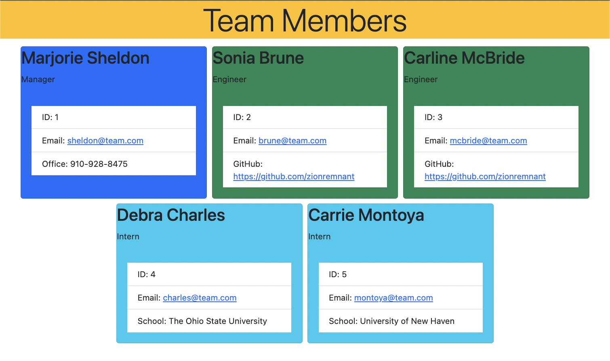

# 10 Object-Oriented Programming: Team Profile Generator

## Overview

This is a Node.js command-line application that takes in information about employees on a software engineering team, then generates an HTML webpage that displays summaries for each person.

## User Story

```md
AS A manager
I WANT to generate a webpage that displays my team's basic info
SO THAT I have quick access to their emails and GitHub profiles
```

## Application Classes

The application includes Employee, Manager, Engineer, and Intern classes. The tests for these classes (in the _tests_ directory) ALL pass.

The first class is an Employee parent class with the following properties and methods:

- name
- id
- email
- getName()
- getId()
- getEmail()
- getRole()—returns 'Employee'

The other three classes extend Employee.

In addition to Employee's properties and methods, Manager also have the following:

- officeNumber
- getRole()—overridden to return 'Manager'

In addition to Employee's properties and methods, Engineer also have the following:

- github—GitHub username
- getGithub()
- getRole()—overridden to return 'Engineer'

In addition to Employee's properties and methods, Intern also have the following:

- school
- getSchool()
- getRole()—overridden to return 'Intern'

## Screenshots

The following image shows the generated HTML’s appearance. The styling is leveraging BootStrap CSS.




## Getting Started

This application uses `Inquirer` for collecting input from the user. The application will be invoked by using the following command:

```bash
node index.js
```

## Running tests

This application uses `Jest` for running the unit tests. The application's tests will be invoked by using the following command:

```bash
npm test
```

## Demo


