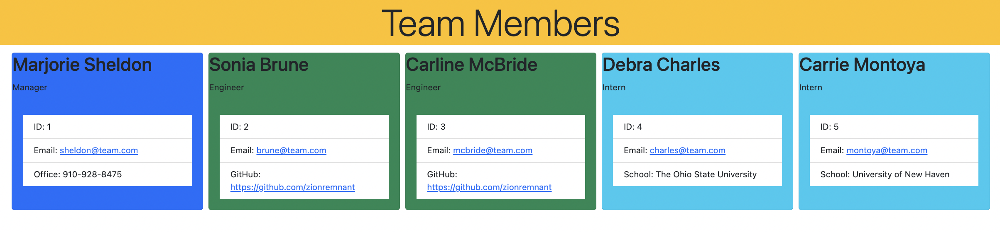

# 10 Object-Oriented Programming: Team Profile Generator

## Overview

This is a Node.js command-line application that takes in information about employees on a software engineering team, then generates an HTML webpage that displays summaries for each person.

## User Story

```md
AS A manager
I WANT to generate a webpage that displays my team's basic info
SO THAT I have quick access to their emails and GitHub profiles
```

## Application Classes

The application includes Employee, Manager, Engineer, and Intern classes. The tests for these classes (in the _tests_ directory) ALL pass.

The first class is an Employee parent class with the following properties and methods:

- name
- id
- email
- getName()
- getId()
- getEmail()
- getRole()—returns 'Employee'

The other three classes extend Employee.

In addition to Employee's properties and methods, Manager also have the following:

- officeNumber
- getRole()—overridden to return 'Manager'

In addition to Employee's properties and methods, Engineer also have the following:

- github—GitHub username
- getGithub()
- getRole()—overridden to return 'Engineer'

In addition to Employee's properties and methods, Intern also have the following:

- school
- getSchool()
- getRole()—overridden to return 'Intern'

## Screenshots

The following image shows the generated HTML’s appearance. The styling is leveraging BootStrap CSS 5.




## Getting Started

This application uses `Inquirer` for collecting input from the user. The application will be invoked by using the following command:

```bash
node index.js
```

## Running tests

This application uses `Jest` for running the unit tests. The application's tests will be invoked by using the following command:

```bash
npm test
```

This homework will combine many of the skills we've covered so far. In addition to the User Story and Acceptance Criteria, we’ve provided some guidelines to help get started.

Your application should use [Jest](https://www.npmjs.com/package/jest) for running the unit tests and [Inquirer](https://www.npmjs.com/package/inquirer) for collecting input from the user. The application will be invoked by using the following command:

```bash
node index.js
```

It is recommended that you start with a directory structure that looks like the following example:

```md
.
├── **tests**/ //jest tests
│ ├── Employee.test.js
│ ├── Engineer.test.js
│ ├── Intern.test.js
│ └── Manager.test.js
├── dist/ // rendered output (HTML) and CSS style sheet  
├── lib/ // classes
├── src/ // template helper code
├── .gitignore // indicates which folders and files Git should ignore
├── index.js // runs the application
└── package.json
```

**Important**: Make sure that you remove `dist` from the `.gitignore` file so that Git will track this folder and include it when you push up to your application's repository.

The application must include `Employee`, `Manager`, `Engineer`, and `Intern` classes. The tests for these classes (in the `_tests_` directory) must ALL pass.

The first class is an `Employee` parent class with the following properties and methods:

- `name`

- `id`

- `email`

- `getName()`

- `getId()`

- `getEmail()`

- `getRole()`&mdash;returns `'Employee'`

The other three classes will extend `Employee`.

In addition to `Employee`'s properties and methods, `Manager` will also have the following:

- `officeNumber`

- `getRole()`&mdash;overridden to return `'Manager'`

In addition to `Employee`'s properties and methods, `Engineer` will also have the following:

- `github`&mdash;GitHub username

- `getGithub()`

- `getRole()`&mdash;overridden to return `'Engineer'`

In addition to `Employee`'s properties and methods, `Intern` will also have the following:

- `school`

- `getSchool()`

- `getRole()`&mdash;overridden to return `'Intern'`

Finally, although it’s not a requirement, consider adding validation to ensure that user input is in the proper format.

## Grading Requirements

> **Note**: If a homework assignment submission is marked as “0”, it is considered incomplete and will not count towards your graduation requirements. Examples of incomplete submissions include the following:
>
> - A repository that has no code
>
> - A repository that includes a unique name but nothing else
>
> - A repository that includes only a README file but nothing else
>
> - A repository that only includes starter code

This homework is graded based on the following criteria:

### Deliverables: 15%

- A sample HTML file generated using the application must be submitted.

- Your GitHub repository containing your application code.

### Walkthrough Video: 32%

- A walkthrough video that demonstrates the functionality of the Team Profile Generator and passing tests must be submitted, and a link to the video should be included in your README file.

- The walkthrough video must show all four tests passing from the command line.

- The walkthrough video must demonstrate how a user would invoke the application from the command line.

- The walkthrough video must demonstrate how a user would enter responses to all of the prompts in the application.

- The walkthrough video must demonstrate a generated HTML file that matches the user input.

### Technical Acceptance Criteria: 40%

- Satisfies all of the preceding acceptance criteria plus the following:

  - Uses the [Inquirer package](https://www.npmjs.com/package/inquirer).

  - Uses the [Jest package](https://www.npmjs.com/package/jest) for a suite of unit tests.

  - The application must have `Employee`, `Manager`, `Engineer`, and `Intern` classes.

### Repository Quality: 13%

- Repository has a unique name.

- Repository follows best practices for file structure and naming conventions.

- Repository follows best practices for class/id naming conventions, indentation, quality comments, etc.

- Repository contains multiple descriptive commit messages.

- Repository contains a high-quality readme with description and a link to a walkthrough video.

## Review

You are required to submit the following for review:

- A walkthrough video that demonstrates the functionality of the application and passing tests.

- A sample HTML file generated using your application.

- The URL of the GitHub repository, with a unique name and a readme describing the project.

---

© 2022 Trilogy Education Services, LLC, a 2U, Inc. brand. Confidential and Proprietary. All Rights Reserved.
